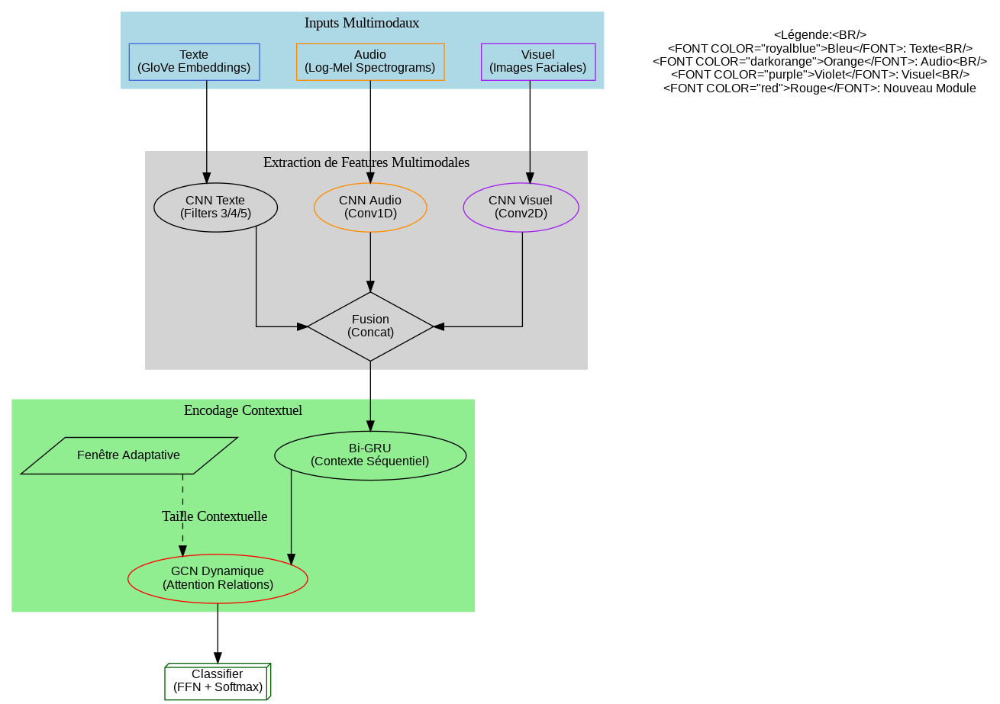

# M3Dialogue: Multimodal Dynamic Memory Network for Emotion Recognition in Conversations

## Introduction

Our proposed architecture, **M3Dialogue** (*Multimodal & Dynamic Memory for Dialogue Emotion Recognition*), represents a significant evolution beyond existing approaches like DialogueGCN and DialogueRNN by addressing three key limitations in current conversation-based emotion recognition systems:

1. **Static Context Modeling**: Traditional GCN-based approaches use fixed relation types
2. **Unimodal Limitations**: Most systems process only textual inputs
3. **Rigid Context Windows**: Fixed-size context windows fail to adapt to conversation dynamics

## Key Innovations Over Previous Architectures

| Feature               | DialogueRNN | DialogueGCN | M3Dialogue (Ours) |
|-----------------------|------------|------------|-------------------|
| **Modality Support**  | Text-only  | Text-only  | Text+Audio+Visual |
| **Relation Modeling** | Sequential | Fixed (2M²) | Dynamic Attention |
| **Context Window**    | Full history | Fixed window | Adaptive learning |
| **Memory Mechanism**  | GRU-based  | None       | Cross-modal Memory |

## Architecture

 

## Pipeline design of DGCN 
 =====================================================================
|                                                                   |
|  [Input Features] (seq_len, batch, D_m)                           |
|        |                                                          |
|        v                                                          |
|  +---------------------+                                          |
|  | BASE MODEL          |                                          |
|  | (DialogRNN/LSTM/GRU)|--> (seq_len, batch, 2*D_e)               |
|  +---------------------+                                          |
|        |                                                          |
|        v                                                          |
|  +---------------------+                                          |
|  | Adaptive Temporal   |                                          |
|  | Attention           |--> Edge weights + Dynamic Connections    |
|  +---------------------+                                          |
|        |                                                          |
|        v                                                          |
|  +---------------------+                                          |
|  | Graph Construction  |                                          |
|  | - edge_index        |--> (2, num_edges)                        |
|  | - edge_norm         |--> (num_edges,)                          |
|  | - edge_type         |--> (num_edges,)                          |
|  +---------------------+                                          |
|        |                                                          |
|        v                                                          |
|  +---------------------+                                          |
|  | Graph Network       |                                          |
|  | - RGCNConv          |--> (num_nodes, graph_hidden_size)        |
|  | - GraphConv         |                                          |
|  +---------------------+                                          |
|        |                                                          |
|        v                                                          |
|  +---------------------+                                          |
|  | Nodal Attention     | (Optionnel)                              |
|  | (MatchingAttention) |--> Features pondérées                   |
|  +---------------------+                                          |
|        |                                                          |
|        v                                                          |
|  +---------------------+                                          |
|  | Classification      |                                          |
|  | - Linear(D_h)       |--> (seq_len, batch, n_classes)           |
|  | - LogSoftmax        |                                          |
|  +---------------------+                                          |
|                                                                   |
=====================================================================
