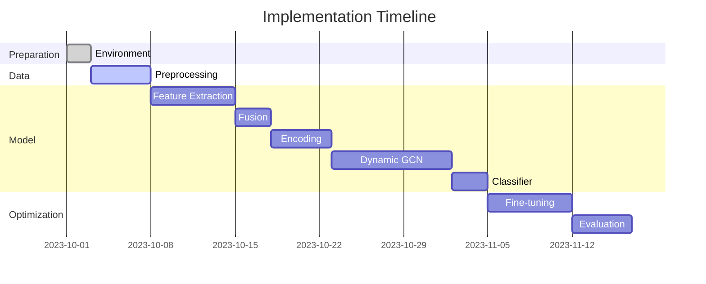

# Implementation Plan - M3Dialogue (GCN Improvement)

Here is a detailed plan for implementing the advanced DialogueGCN++ architecture, organized into clear phases with deliverables and dependencies:

| **Phase**                | **Task**                         | **Subtasks**                                                                | **Estimated Duration** | **Deliverables**                            | **Dependencies** |
|--------------------------|----------------------------------|---------------------------------------------------------------------------|------------------------|--------------------------------------------|-----------------|
| **1. Preparation**        | Environment Setup                | - Install PyTorch/TensorFlow - Configure CUDA if GPU - Structure project (modules/tests) | 2 days                  | Functional environment Project structure | None            |
| **2. Multimodal Inputs**  | Data Integration                 | - Adapt loaders for MELD/IEMOCAP - Text preprocessing (Glove/BERT) - Audio conversion → log-mel spectrograms - Facial detection (MTCNN) | 5 days                  | Unified data pipeline Preprocessed examples | Phase 1         |
| **3. Feature Extraction** | Specialized CNN Modules          | - Text: Multi-filter CNN (3/4/5) - Audio: Optimized Conv1D - Visual: Conv2D with modified ResNet | 7 days                  | Individually tested modules Performance benchmarks | Phase 2         |
| **4. Multimodal Fusion**  | Fusion Strategy                  | - Smart concatenation - Layer-specific normalization - Adaptive dropout | 3 days                  | Merged features (consistent shape)        | Phase 3         |
| **5. Context Encoding**   | Bi-GRU + Adaptive Window         | - Implement Bi-GRU with masks - Dynamic window mechanism - Handling padding sequences | 5 days                  | Encoded conversational context            | Phase 4         |
| **6. Dynamic GCN**        | Graph Relations with Attention   | - Construct conversational graph - Relational attention mechanism - Iterative GCN layers | 10 days                 | Tested GCN module Visualizable attention matrices | Phase 5         |
| **7. Classifier**         | FFN + Softmax                    | - Fully Connected Layers - Advanced regularization (Label Smoothing) - Loss optimization (Focal Loss) | 3 days                  | Emotion probabilities                      | Phase 6         |
| **8. Optimization**       | Global Fine-Tuning               | - Hyperparameter search (Optuna) - Early Stopping - Gradient Clipping | 7 days                  | Best model saved                          | Phases 1-7      |
| **9. Evaluation**         | Benchmarks                       | - Comparison with base GCN - Metrics: F1, Accuracy, Confusion Matrix - Error analysis | 5 days                  | Performance report Visualizations     | Phase 8         |

## Visual Roadmap (Simplified Gantt Chart)

